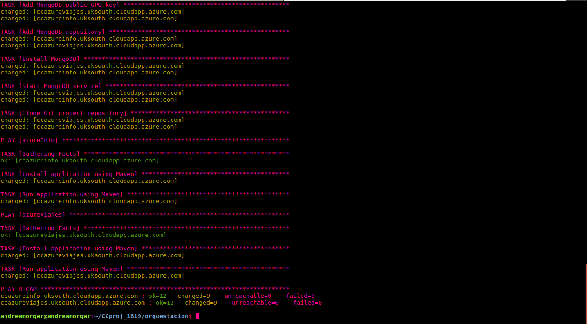
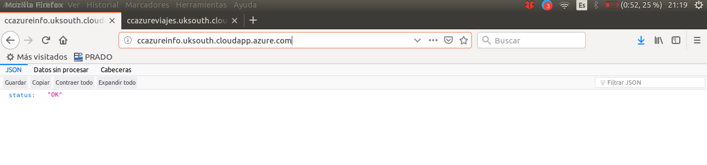
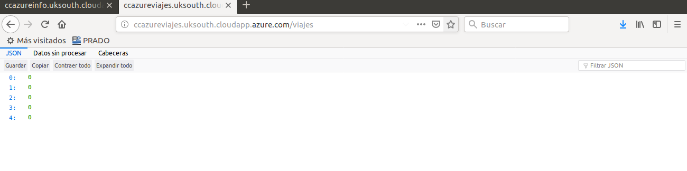

# Prueba de Orquestación de máquinas Virtuales

Realizado por: Andrea Morales Garzón (@andreamorgar)

---

## Procedimiento

En primer lugar, he hecho fork del repositorio con su posterior clone. Nos situamos en el directorio [CCproj_1819/orquestacion](https://github.com/andreamorgar/CCproj_1819/tree/master/orquestacion), que es donde se encuentra el fichero [Vagrantfile](https://github.com/andreamorgar/CCproj_1819/blob/master/orquestacion/Vagrantfile) a partir del cual se van a crear y provisionar las máquinas virtuales.

En este caso, vamos a crear las distintas máquinas virtuales (dos en total), con órdenes separadas de Vagrant, de forma, que cada una será creada ejecutando la orden `vagrant up <maquina>`.

Comenzamos con la primera de las máquinas, la igual la identificamos con el nombre de `info`, tal y como se puede ver en la siguiente imagen. Además, también podemos ver en la imagen la creación de la segunda máquina virtual (`viajes`), que es la que se encarga de ejecutar el playbook.
.

A primera vista puede parecer que solo se está realizando el provisionamiento para la segunda máquina, pero no es cierto, ya que el playbook utiliza grupos, de forma que distingue entre los provisionamiento, tanto para la máquina virtual `viajes` como para `info`. Como el playbook es extenso, no voy a mostrar toda la salida que genera el provisionamiento, pero sí voy a mostrar en la siguiente imagen la finalización del provisionamiento con ansible, donde se puede ver que finaliza de forma correcta. Si nos fijamos en las dos últimas líneas mostradas por la terminal, vemos las dos direcciones a las que tenemos que acceder para poder realizar consultas a los servicios REST.

Para comprobar que el provisionamiento se ha realizado de manera correcta, vamos a acceder a dichas rutas. En el caso de la primera de las máquinas, podemos observar que obtenemos `status:OK`, lo cuál se puede ver en la siguiente imagen.

Si accedemos a la otra máquina, también obtenemos `status:OK`, como se observa a continuación.

Por último, vamos a acceder a otras rutas (con información), modificando las direcciones de la forma que me ha indicado Miguel. En la siguiente imagen, podemos ver el resultado de acceder a una ruta con información del servicio REST de la máquina virtual  denominada como `info` en Vagrant.

De igual forma, se aprecia en la imagen que se muestra a continuación, que podemos acceder a una ruta con información del servicio REST de la máquina virtual  denominada `viajes` en Vagrant.

---

**En conclusión, las máquinas están correctamente provisionadas y creadas desde Vagrantfile. Además, me ha parecido muy interesante y muy útil que ambas máquinas estén en completo funcionamiento desde que finaliza el provisionamiento, ya que no hay que acceder a la máquina virtual para arrancar el servicio, sino que se ha automatizado el proceso.**
